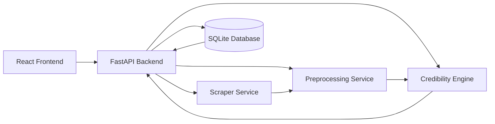

# MediaVerify

MediaVerify is a full-stack web application for evaluating the credibility of news-style content. A user can submit either pasted text or a public article URL, and the system extracts the content, applies an explainable scoring pipeline, returns a credibility result, and stores the analysis for later review.

The project focuses on transparency as much as prediction. Instead of treating sentiment as a proxy for credibility, MediaVerify uses source-aware and language-aware verification signals so that the output is easier to inspect, explain, and improve over time.

## Key Features

- Analyze either pasted article text or a live public article URL.
- Create an account and keep a private, user-specific analysis history.
- Extract likely article-body content instead of scoring an entire webpage.
- Score content using explainable credibility signals rather than pure sentiment.
- Return a credibility score, a three-level label, confidence value, and explanation signals.
- Store previous analyses in SQLite and surface them in the dashboard.
- Provide a clean React frontend backed by a FastAPI API.

## How It Works

1. The user submits either article text or a public URL from the frontend.
2. The backend normalizes the input and extracts article-body content when a URL is provided.
3. The credibility engine evaluates the content using source trust, attribution cues, evidence wording, dates, quotes, and suspicious phrasing.
4. Authenticated users receive a credibility score, a label, a confidence estimate, and explanation signals.
5. The result is stored in the signed-in user's history and displayed in the interface.

## Tech Stack

- Frontend: React, Vite, CSS
- Backend: FastAPI, Python 3.11
- Scraping and parsing: Requests, BeautifulSoup
- Storage: SQLite
- Authentication: account registration, login, hashed passwords, session tokens
- Containerization: Docker, Docker Compose

## What This Project Demonstrates

- End-to-end full-stack development with React, FastAPI, and SQLite
- API design for preprocessing, scoring, persistence, and history retrieval
- Explainable scoring logic for a real-world content analysis problem
- Practical handling of article scraping, content normalization, and frontend-backend integration
- Product-oriented UI work focused on clarity, workflow, and usability

## Architecture Overview



## Why the Credibility Engine Was Redesigned

Early versions of MediaVerify used transformer-based sentiment analysis as a simplified credibility approximation. During testing, this produced unrealistic behavior because legitimate but emotionally negative reporting was often classified as low credibility.

To improve realism and explainability, the project evolved into a feature-based scoring pipeline that evaluates attribution language, evidence wording, source trust, traceability signals, and suspicious phrasing patterns.

## Project Structure

```text
mediaverify/
├── backend/
│   ├── app/
│   │   ├── api/
│   │   ├── db/
│   │   ├── models/
│   │   └── services/
│   ├── Dockerfile
│   └── requirements.txt
├── frontend/
│   ├── public/
│   ├── src/
│   │   ├── components/
│   │   ├── services/
│   │   └── assets/
│   ├── Dockerfile
│   └── package.json
├── docker-compose.yml
├── IMPLEMENTATION_LOG.md
└── README.md
```

## Prerequisites

- Python 3.11+
- Node.js 22+ recommended
- npm
- pip
- Docker Desktop, if you want to run the containerized setup

## Run Locally

### 1. Clone the repository

```bash
git clone https://github.com/iamshahid555/mediaverify.git
cd mediaverify
```

### 2. Set up and run the backend

```bash
python3 -m venv .venv
source .venv/bin/activate
pip install -r backend/requirements.txt
cd backend
uvicorn app.main:app --reload --host 127.0.0.1 --port 8000
```

The backend API will run at `http://127.0.0.1:8000`.

### 3. Set up and run the frontend

Open a second terminal in the project root:

```bash
cd frontend
npm install
npm run dev
```

The frontend will run at `http://localhost:5173`.

### 4. Optional frontend API configuration

The frontend defaults to `http://127.0.0.1:8000`. To point it somewhere else, create `frontend/.env.local` and set:

```bash
VITE_API_URL=http://127.0.0.1:8000
```

## Run With Docker

```bash
docker compose up --build
```

Default URLs:

- Frontend: `http://localhost:5173`
- Backend API: `http://127.0.0.1:8000`
- API docs: `http://127.0.0.1:8000/docs`

## API Overview

- `GET /`
  Returns a simple backend status message.

- `GET /health`
  Returns a health-check response.

- `POST /analyze`
  Accepts either raw text or a public URL and returns a credibility score, label, confidence value, and explanation signals.

- `GET /history`
  Returns the signed-in user's stored analysis results.

- `POST /auth/register`
  Creates a user account and returns a session token plus the user profile.

- `POST /auth/login`
  Authenticates an existing user and returns a session token plus the user profile.

- `GET /auth/me`
  Returns the current signed-in user for the provided session token.

- `POST /auth/logout`
  Ends the active session token.

### Example Request Bodies

Text analysis:

```json
{
  "text": "According to the national weather service, heavy rainfall is expected across the region this weekend, and local authorities have advised residents in flood-prone areas to monitor official updates."
}
```

URL analysis:

```json
{
  "url": "https://www.cdc.gov/flu/vaccines/"
}
```

## Credibility Engine

The current scoring pipeline is rule-based and feature-driven. It is intentionally explainable and behaves more realistically than a sentiment classifier used as a credibility proxy.

Signals currently considered include:

- known or low-trust source domains
- attribution language such as "according to", "reported", or "confirmed"
- evidence wording such as "study", "data", "statement", or "report"
- traceability cues such as dates and direct quotes
- sensational, conspiratorial, or absolutist phrasing

This makes the output easier to explain, inspect, and refine. It also provides a clear baseline for future work involving trained misinformation or claim-verification models.

Current labels:

- `Likely Credible` for stronger source and wording signals
- `Needs Review` for borderline or unknown-source cases that deserve manual checking
- `Possibly Non-Credible` for weaker source support and stronger risk signals

## Data Persistence

Analysis history is stored in SQLite at `backend/app/mediaverify.db`.

Each history record includes:

- input type
- credibility score
- credibility label
- confidence
- content preview
- source URL and source domain for URL-based submissions
- timestamp
- the user account that owns the record

## Scripts

Frontend scripts:

- `npm run dev` - start the Vite development server
- `npm run build` - create a production build
- `npm run lint` - run ESLint
- `npm run preview` - preview the production build locally

Backend command:

- `uvicorn app.main:app --reload --host 127.0.0.1 --port 8000` - start the FastAPI development server

## Testing

Backend unit and API tests are included for the scoring engine, preprocessing flow, authentication flow, and core API behavior.

Run them with:

```bash
cd backend
../.venv/bin/python -m unittest discover -s tests -v
```

## Current Limitations

- Article extraction quality depends on the publisher layout and how cleanly page content can be parsed.
- The scoring engine is practical and explainable, but it remains heuristic and is not a replacement for full fact-checking.
- Domain trust coverage is limited and can be expanded for broader source handling.
- Session tokens are stored locally in the browser for convenience and are not yet backed by token expiry or refresh logic.


## Future Improvements

- Expand backend test coverage and add frontend component tests
- Add filtering and richer drill-down for saved history items
- Expand publisher-specific scraping rules for more reliable article extraction
- Improve source reputation coverage and explanation quality for borderline cases
- Add session expiry and stronger account security controls
- Add profile settings and account management
- Introduce a trained misinformation or claim-verification model on top of the current baseline

## License

This project is licensed under the MIT License.
